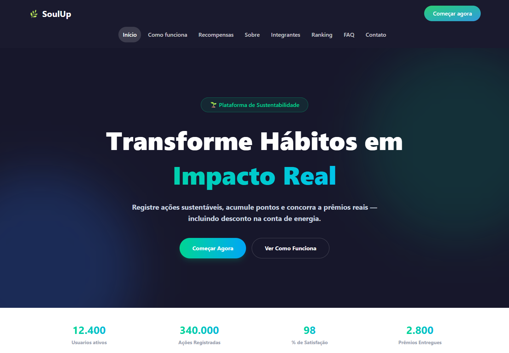
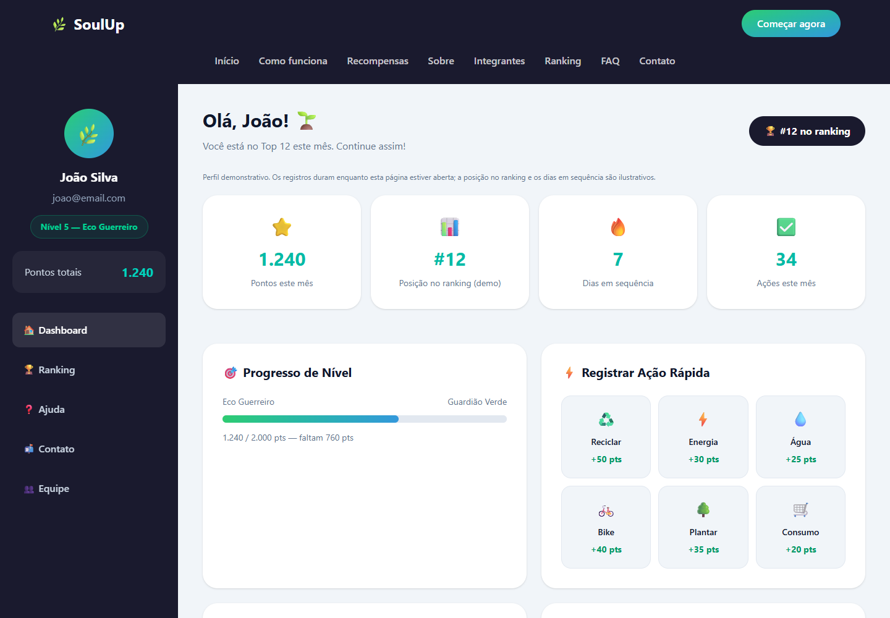
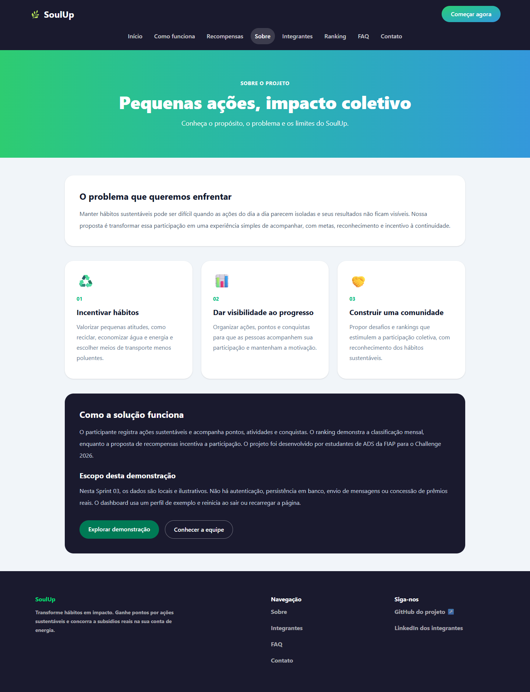
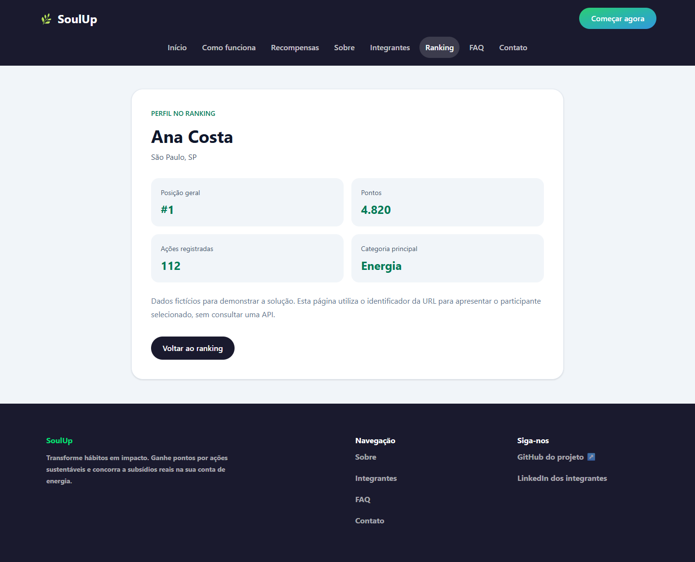
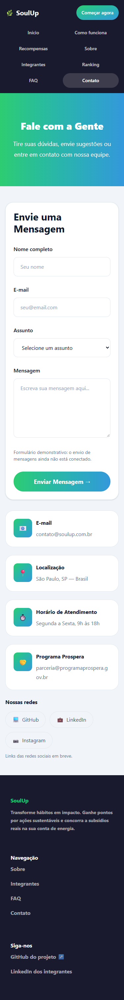

# 🌿 SoulUp | Challenge 2026

Aplicação acadêmica de incentivo a hábitos sustentáveis, desenvolvida para a disciplina **Front-End Design Engineering**, do curso de Análise e Desenvolvimento de Sistemas da FIAP.

O SoulUp apresenta uma proposta de gamificação: registrar ações sustentáveis, acompanhar pontos e conquistas e visualizar rankings e recompensas. A interface foi construída como uma **Single Page Application (SPA)** em React, Vite e TypeScript.

> **Etapa atual: Sprint 03.** Este projeto é um protótipo navegável com dados de demonstração. Não há autenticação real, integração com API, banco de dados, envio de e-mail ou entrega real de recompensas. Os registros do dashboard permanecem somente no estado da página.
>
> **Situação da entrega:** os requisitos técnicos identificados foram implementados e testados localmente. O link do vídeo foi adicionado; ainda faltam as etapas de versionamento/publicação/empacotamento da entrega. A conformidade acadêmica final depende da revisão da equipe e do professor.

## Sumário

- [Objetivo e funcionalidades](#objetivo-e-funcionalidades)
- [Tecnologias utilizadas](#tecnologias-utilizadas)
- [Estrutura de pastas](#estrutura-de-pastas)
- [Como usar](#como-usar)
- [Páginas e navegação](#páginas-e-navegação)
- [Imagens e ícones do projeto](#imagens-e-ícones-do-projeto)
- [Autores e créditos](#autores-e-créditos)
- [Contato](#contato)
- [Auditoria dos requisitos da Sprint 03](#auditoria-dos-requisitos-da-sprint-03)
- [Testes e limitações](#testes-e-limitações)
- [Checklist de entrega](#checklist-de-entrega)

## Objetivo e funcionalidades

A solução procura tornar visíveis as pequenas ações sustentáveis do dia a dia e incentivar sua continuidade por meio de pontuação e reconhecimento.

Funcionalidades implementadas:

- Página inicial com apresentação, contadores animados, funcionamento da proposta e recompensas.
- Ranking demonstrativo com filtros por categoria, pódio, tabela de classificação e contagem até o encerramento do mês.
- FAQ com busca textual, respostas expansíveis e aviso quando não há resultados.
- Formulário de contato tipado, com campos obrigatórios, validação e mensagens de erro.
- Dashboard demonstrativo com registro rápido de ações, atualização de pontos, progresso de nível, atividades recentes e conquistas.
- Página de integrantes com fotos, nomes, RMs, turmas, e-mails e links individuais.
- Página Sobre com problema, objetivos, solução e escopo.
- Detalhe de participante em `/ranking/:id`, com tratamento de identificador inválido e retorno ao ranking.
- Layouts adaptáveis a celulares, tablets e desktops.

Limites do protótipo:

- “Começar agora” abre diretamente o dashboard do perfil demonstrativo João Silva; não existe cadastro ou login.
- O formulário informa que os dados foram validados, mas não envia mensagens.
- A posição no ranking e a sequência de dias são ilustrativas.
- Recarregar ou sair do dashboard reinicia o estado demonstrativo.
- O FAQ explica os limites atuais: sem cadastro, envio de mensagens ou saldo permanente.
- Home, ranking e FAQ compartilham os prêmios propostos de R$ 200, R$ 100 e R$ 50, definidos em `src/data/premios.ts`. Não há concessão real de prêmios.

## Tecnologias utilizadas

As faixas abaixo refletem o `SoulUp/package.json` auditado; as versões resolvidas são controladas pelo `package-lock.json`.

| Tecnologia | Faixa declarada | Uso |
| --- | --- | --- |
| React / React DOM | ^19.2.8 | Interface, estado e componentes |
| Vite | ^8.2.2 | Servidor local e build |
| TypeScript | ~6.0.2 | Tipagem de props, dados e formulários |
| Tailwind CSS | ^4.3.3 | Classes utilitárias e responsividade |
| React Router, pacote `react-router` | ^8.3.1 | Rotas, navegação e layout com Outlet |
| React Hook Form | ^7.87.0 | Formulário de contato e busca tipada do FAQ |
| ESLint | ^10.10.0 | Análise estática do código, com plugins de React e TypeScript |
| Git e GitHub | Não aplicável | Histórico e colaboração |

O pacote **react-router** foi mantido: a equipe confirmou que seu uso foi permitido pelo professor. Não foi substituído por react-router-dom. As versões declaradas das dependências anteriores foram preservadas. Com autorização da equipe, o lockfile do React Router foi alinhado de 8.3.0 para 8.3.1, pois o package.json já exigia ^8.3.1. As únicas novas dependências são ferramentas de desenvolvimento do ESLint.

Não foram identificados Bootstrap, Material UI, Chakra UI, jQuery, Axios ou outra biblioteca de UI/requisição proibida nas dependências diretas e no código consultado.

## Estrutura de pastas

Estrutura atual do repositório, não uma estrutura futura:

```text
challenge-sem02/
├── .git/                       # Histórico local; deve acompanhar o ZIP
├── README.MD                   # Este documento
└── SoulUp/
    ├── docs/
    │   └── imagens/            # Capturas reais para a documentação
    ├── public/
    │   └── equipe/             # Fotos dos cinco integrantes
    ├── src/
    │   ├── components/         # Navegação, cards, formulário e painéis
    │   ├── data/               # Prêmios compartilhados entre telas
    │   ├── pages/
    │   │   ├── Inicio/
    │   │   ├── Sobre/
    │   │   ├── ComoFunciona/
    │   │   ├── Recompensas/
    │   │   ├── Ranking/        # Ranking, dados e DetalheRanking
    │   │   ├── Faq/
    │   │   ├── Contato/
    │   │   ├── Dashboard/
    │   │   ├── Equipe/
    │   │   └── Error/
    │   ├── App.tsx             # Layout compartilhado com Outlet
    │   ├── main.tsx            # Inicialização e definição das rotas
    │   └── global.css          # Somente importação do Tailwind
    ├── index.html
    ├── package.json
    ├── package-lock.json
    ├── tsconfig*.json
    ├── eslint.config.js
    └── vite.config.ts
```

Todas as páginas estão em `src/pages`, conforme as páginas 29 e 34 do PDF. Os imports dos componentes foram atualizados; não há duas cópias das páginas.

## Como usar

### Links da entrega

- **GitHub:** [Pedro-H-Salvatore/challenge-sem02](https://github.com/Pedro-H-Salvatore/challenge-sem02).
- **YouTube:** [Vídeo de apresentação do SoulUp — Sprint 03](https://www.youtube.com/watch?v=xs5BvgpO3hU).

O endereço do GitHub foi obtido do remoto `origin`. A acessibilidade pública do repositório não foi confirmada nesta auditoria; conferir em uma janela anônima antes da entrega.

### Pré-requisitos

- Git para clonar o repositório.
- Node.js compatível com o Vite instalado: `^20.19.0 || >=22.12.0`, conforme o campo `engines` do pacote local.
- npm.
- Navegador atualizado.

Ambiente verificado: Node.js **24.15.0**, Windows e Microsoft Edge em execução automatizada.

### Instalação e execução local

```bash
git clone https://github.com/Pedro-H-Salvatore/challenge-sem02.git
cd challenge-sem02/SoulUp
npm ci
npm run dev
```

Abra a URL exibida no terminal, normalmente `http://localhost:5173`. Execute os comandos de npm dentro da pasta **SoulUp**, que contém o `package.json`.

Se você já tem o repositório, entre em `SoulUp` e execute os três últimos comandos. As correções desta revisão estão no diretório de trabalho da branch `PedroSalvatore-RM569497`, sobre o commit `473f920`, e ainda precisam ser commitadas. A cópia local de `main` está um commit atrás da base. O fluxo de clone acima usará a branch padrão publicada: as alterações finais precisam ser integradas e enviadas à `main` antes da entrega.

### Build e pré-visualização

```bash
npm run build
npm run preview
```

O build executa TypeScript e gera a aplicação em `SoulUp/dist`. A pré-visualização imprime seu endereço no terminal. Para analisar o código, execute `npm run lint`.

O `.gitignore` do aplicativo agora permite versionar `package-lock.json`, que antes era ignorado por uma regra da raiz. Inclua esse arquivo no commit junto com `package.json` para que `npm ci` funcione após o clone.

Observações de ambiente:

- O `tsconfig.app.json` atual grava cache em `../node_modules/.tmp/tsconfig.app.tsbuildinfo`. Isso exige permissão de escrita na pasta pai. Foi necessário liberar a escrita dos caches e de `dist` no ambiente da auditoria.
- `npm run lint` funciona com ESLint e os plugins declarados. A configuração existente foi mantida, sem desabilitar regras para esconder problemas.
- Instalação limpa validada em uma cópia separada: `npm ci`, `npm run lint` e `npm run build` concluídos com sucesso. O download requer acesso ao registro npm.

### Roteiro de demonstração

1. Abra a Home e navegue pelos links do cabeçalho.
2. Abra Sobre para conhecer o escopo. Em Ranking, alterne as categorias e clique no nome de um participante para abrir `/ranking/:id`. Teste o retorno e um identificador inexistente.
3. Em FAQ, busque uma pergunta, expanda a resposta e experimente uma busca sem resultados.
4. Em Contato, envie campos vazios para observar as mensagens; depois preencha dados válidos e veja o aviso de demonstração.
5. No Dashboard, clique em uma ação rápida e observe os pontos e as atividades.
6. Abra Integrantes pelo cabeçalho, rodapé ou menu lateral do Dashboard.

## Páginas e navegação

| Caminho atual | Conteúdo | Observação |
| --- | --- | --- |
| `/` | Home | Inclui funcionamento e recompensas |
| `/como-funciona` | Explicação em três passos | Existe como rota e como seção da Home |
| `/sobre` | Sobre o projeto | Problema, objetivos, solução e escopo |
| `/#como-funciona` | Âncora da Home | Acesso à seção de funcionamento |
| `/#recompensas` | Âncora da Home | Recompensas não têm rota própria |
| `/ranking` | Ranking e prêmios | Página da solução com dados locais |
| `/ranking/:id` | Detalhe do participante | Parâmetro obtido por `useParams`, validado contra os dados locais |
| `/dashboard` | Perfil e ações rápidas | Página da solução com estado local |
| `/faq` | Perguntas e respostas | Busca e expansão de respostas |
| `/contato` | Formulário e informações | Validação com React Hook Form |
| `/equipe` | Integrantes | Fotos, turmas e links individuais |
| `*` | Página não encontrada | Mensagem e navegação de volta |

Exemplos de rotas dinâmicas: `/ranking/1` e `/ranking/4` exibem pessoas diferentes com o mesmo componente. `/ranking/999` ou `/ranking/abc` exibem feedback de participante não encontrado. A página Sobre é dedicada, separada da seção Como funciona.

## Imagens e ícones do projeto

Capturas reais da aplicação local, geradas durante a auditoria:

### Home em desktop



### Dashboard em desktop



### Sobre o projeto



### Rota dinâmica do ranking



### Contato em celular



Os ícones da interface são emojis, como 🌿, ♻️, 🏆 e 💧. As fotografias foram fornecidas pelos integrantes e estão em `SoulUp/public/equipe`. As capturas representam o protótipo; não comprovam integração com backend.

## Autores e créditos

Turmas confirmadas pela equipe nesta revisão.

| Foto | Integrante | RM | Turma | Perfis |
| --- | --- | --- | --- | --- |
|  | Luigi Tormim | 572424 | 1TDSPH | [GitHub](https://github.com/LuigiT2703) · [LinkedIn](https://www.linkedin.com/in/luigi-tormim-b64738393) |
|  | Pedro Salvatore | 569497 | 1TDSPH | [GitHub](https://github.com/Pedro-H-Salvatore) · [LinkedIn](https://www.linkedin.com/in/pedro-salvatore-a4a2763b7/) |
|  | Gabriel Tavares | 571113 | 1TDSPV | [GitHub](https://github.com/gabristavares) · [LinkedIn](https://www.linkedin.com/in/gabrielst1005) |
|  | Cauã de Souza | 573349 | 1TDSPH | [GitHub](https://github.com/cauadesouzavasconcellos-byte) · [LinkedIn](https://www.linkedin.com/in/cauã-souza-b92261395) |
|  | Leonardo De Souza Bernard | 570951 | 1TDSPV | [GitHub](https://github.com/bernardleonardo) · [LinkedIn](https://www.linkedin.com/in/leonardo-de-souza-573306410) |

Projeto acadêmico realizado para o Challenge FIAP/SoulUp. Houve apoio do Codex em implementação, ajustes e documentação; a equipe deve revisar, compreender e conseguir explicar o código entregue. A auditoria local não comprova originalidade em relação a trabalhos de outros grupos ou templates externos.

## Contato

- **Luigi:** [luigitormim27@gmail.com](mailto:luigitormim27@gmail.com)
- **Pedro:** [pedrosalvatore2112@gmail.com](mailto:pedrosalvatore2112@gmail.com)
- **Gabriel:** [gabriel.stavares05@gmail.com](mailto:gabriel.stavares05@gmail.com)
- **Cauã:** [Cauadesouzavasconcellos@gmail.com](mailto:Cauadesouzavasconcellos@gmail.com)
- **Leonardo:** [sbleonardo@icloud.com](mailto:sbleonardo@icloud.com)

Os endereços institucionais exibidos na página Contato são dados do protótipo, não canais verificados. Para falar com a equipe, utilize os contatos acima.

## Auditoria dos requisitos da Sprint 03

**Fonte:** documento “1TDS Fevereiro - Challenge 2026 - 2º Semestre (1).pdf”, seção Front-End Design Engineering, páginas **27 a 44**.

**Revisão:** 12/09/2026, alterações locais sobre `473f920`. Inclui implementação dos itens antes pendentes. As mudanças ainda não foram commitadas/publicadas.

Legenda:

- **Atendido:** evidência localizada e, quando indicado, testada.
- **Parcial:** há implementação, mas também divergência ou limitação.
- **Pendente:** requisito não encontrado ou item ainda não fornecido.
- **A confirmar:** depende do professor, de serviço externo, de outro artefato ou de revisão humana.

### 1. React, Vite, TypeScript e páginas - bloco de 20 pontos

| Requisito | Situação | Evidência / providência |
| --- | --- | --- |
| React + Vite + TypeScript obrigatórios | Atendido | Dependências, `vite.config.ts`, `.tsx` e build |
| Home, Sobre, FAQ, Contato, Integrantes e solução em React | Atendido quanto às páginas obrigatórias | Páginas em `src/pages`, com Sobre dedicada; a equipe deve comparar a preservação integral do conteúdo com sua entrega anterior |
| SPA com React Router | Atendido funcionalmente | `createBrowserRouter`, `RouterProvider`, `Outlet`, `Link` e `NavLink` |
| React Router | Atendido conforme autorização informada | Mantido `react-router`, permitido pelo professor segundo a equipe |
| Pastas `src/components` e `src/pages` | Atendido | Páginas movidas e imports ajustados |
| Tipagem de componentes, props e dados | Atendido | Interfaces e tipos em cards, ranking, dashboard e contato; TypeScript compilou |

### 2. Componentização e modularidade - bloco de 15 pontos

| Requisito | Situação | Evidência / providência |
| --- | --- | --- |
| Componentes reutilizáveis: Header, Footer, Layout, Cards, Botões etc. | Atendido | `BarraNavegacao`, `Footer`, `App` como layout, `CardMedalha`, `ParticipantesCards`, `PainelDashboard`, `CampoContato` |
| Divisão lógica em arquivos e pastas | Atendido | `components`, `pages` e `data`; prêmios compartilhados |
| Nomenclatura, funções claras e padrões React | Atendido tecnicamente | Componentes funcionais, tratamento de erro e limpeza dos efeitos; avaliação qualitativa do professor |

A exclusão anterior de `Layout.tsx` vazio não removeu o layout funcional: essa função continua em `App.tsx`, com cabeçalho, `Outlet` e rodapé.

### 3. Hooks, props e rotas - bloco de 20 pontos

| Requisito | Situação | Evidência / providência |
| --- | --- | --- |
| `useState` em pelo menos dois componentes | Atendido | ItemFaq, Ranking, Dashboard, formulário e contadores |
| `useEffect` para controle de efeitos | Atendido | ContagemRanking, ScrollToHash e Contador; dependências e cancelamento de frames corrigidos |
| `useNavigate` e `useParams` | Atendido | DetalheRanking recebe `id` com `useParams` e retorna via `useNavigate`; cabeçalho e Hero também usam navegação |
| Passagem correta de props | Atendido | Dados e callbacks passados entre componentes |
| Rotas estáticas | Atendido | Oito páginas estáticas, incluindo `/sobre`, definidas em `src/main.tsx` |
| Rotas dinâmicas e passagem de parâmetros | Atendido | `/ranking/:id`, acessível pelo pódio e pela tabela; casos válidos e inválidos testados |

### 4. Tailwind e responsividade - bloco declarado de 20 pontos

| Requisito | Situação | Evidência / providência |
| --- | --- | --- |
| Layout consistente e adequado à proposta | Atendido nos testes / avaliação visual | Identidade preservada, links preenchidos e prêmios alinhados; qualidade final depende da avaliação do professor |
| Tailwind aplicado, sem CSS externo/manual | Atendido | `global.css` contém apenas o import do Tailwind; progresso nativo estilizado com utilitários, sem `style` inline |
| Mobile até 480 px | Atendido nos testes | 320, 375 e 480 px |
| Tablet de 768 px | Atendido nos testes | 768 px |
| Desktop a partir de 992 px | Atendido nos testes | 992, 1024, 1280 e 1920 px |

A tabela do ranking possui rolagem horizontal **interna** para manter as colunas legíveis. Não houve overflow horizontal da página nas 88 combinações de rota e largura verificadas. Isso não equivale a testar todos os dispositivos, navegadores, orientações e níveis de zoom existentes.

**Inconsistência do enunciado:** a página 37 declara máximo de 20 pontos para esse bloco, mas seus subitens somam 25 (5 + 10 + 3 + 3 + 4). Não foi calculada uma nota final; a equipe deve confirmar a distribuição com o professor.

### 5. Formulários com React Hook Form - bloco de 5 pontos

| Requisito | Situação | Evidência / providência |
| --- | --- | --- |
| Formulário com `useForm()` | Atendido | `FormularioContato.tsx` |
| Campos obrigatórios e validações | Atendido | Nome completo, formato de e-mail, assunto e mensagem |
| Mensagens de erro claras | Atendido | `CampoContato`, `role="alert"` e indicação visual |
| Tipagem TypeScript no formulário | Atendido | `DadosContato` e `useForm<DadosContato>` |
| Organização e experiência visual | Atendido nos testes | Labels, foco, feedback e adaptação mobile |
| React Hook Form em toda entrada de texto/formulário | Atendido | Contato usa `useForm`; busca do FAQ usa `useForm`, `useWatch`, limite de 100 caracteres e submit sem recarregar |

A ausência de envio real no formulário não é, por si só, uma falha da Sprint 03: a página 31 determina que **não haverá consumo de API nesta etapa**.

### 6. GitHub e colaboração - bloco de 5 pontos

| Requisito | Situação | Evidência / providência |
| --- | --- | --- |
| Repositório no GitHub e URL no README | Parcialmente verificado | Remoto `origin` configurado e URL documentada; acesso público não confirmado |
| Branches e commits regulares | Atendido estruturalmente | Branches dos integrantes e merges no histórico; relevância das mensagens precisa de revisão humana |
| Pelo menos 5 commits por integrante e 15 no total | Atendido no histórico local | Contagem abaixo |
| Participação visível de todos | Atendido no histórico local | Autores identificados; confirmar atribuição às contas GitHub |
| Entrega final na branch principal `main` | Pendente | `main` existe, mas está um commit atrás da branch auditada; README e capturas ainda não foram commitados |

Contagem em `HEAD`, excluindo merges, obtida com `git shortlog -sn --no-merges HEAD`:

| Integrante / autor identificado | Commits sem merge |
| --- | ---: |
| Pedro / Pedro-H-Salvatore | 16 |
| Leonardo / bernardleonardo | 17 |
| Luigi / Luigi Tormim | 11 |
| Gabriel / gabristavares | 8 |
| Cauã / cauadesouzavasconcellos | 6 |
| **Total sem merges** | **58** |

O histórico completo de `HEAD` contém **63 commits**; `main` contém **62**. Há um alias adicional do Pedro em um merge. O e-mail gravado nos commits do Gabriel aparenta estar malformado; conferir a associação à conta, sem reescrever o histórico automaticamente.

Quantidade não garante que todos os commits sejam significativos: há mensagens genéricas como “arrumando código”. Não foram criados commits artificiais nem executados commit, merge ou push durante a auditoria.

### 7. README e informações da equipe - bloco de 10 pontos

| Requisito | Situação após esta revisão |
| --- | --- |
| Título e descrição | Atendido |
| Tecnologias utilizadas | Atendido |
| Estrutura de pastas | Atendido, descrevendo a estrutura real |
| Nome, RM, turma, foto, GitHub e LinkedIn de cada integrante | Atendido neste README |
| Imagens e ícones relacionados ao projeto | Atendido com capturas reais, fotos e emojis |
| Instalação, execução e uso | Atendido; instalação limpa, lint e build testados |
| Link do repositório | Atendido documentalmente; acesso público a confirmar |
| Link do vídeo no YouTube | Adicionado na seção Como usar; conteúdo e acesso público a conferir |
| Contato com a equipe | Atendido |

As turmas estão tanto neste documento quanto nos cards da página Integrantes.

### Regras gerais e proibições

| Regra | Verificação |
| --- | --- |
| Não consumir API na Sprint 03 | Atendido: dados locais e estado React; nenhuma integração HTTP identificada |
| Não usar UI frameworks proibidos nem Axios | Nenhum encontrado nas dependências diretas/código examinados |
| Não usar template pronto nem copiar outros grupos | Não verificável apenas por inspeção local; responsabilidade da equipe |
| Não enviar `node_modules` | ZIP ainda não produzido/verificado; excluir a pasta na raiz e dentro de SoulUp |
| Preservar histórico Git | `.git` existe na raiz; deve acompanhar a entrega |
| ZIP completo, válido e até 50 MB | Pendente de empacotamento e teste |
| Entregar pelo portal e não apenas link | Pendente de entrega pela equipe |
| Repositório acessível ao avaliador | A confirmar externamente |

## Testes e limitações

Verificações desta revisão:

- `npm run build`: aprovado.
- `npm run lint`: aprovado, sem desabilitar regras.
- Instalação limpa em cópia isolada: `npm ci`, lint e build aprovados.
- Responsividade: 11 caminhos (incluindo detalhe, ID inexistente e 404) em oito larguras: 320, 375, 480, 768, 992, 1024, 1280 e 1920 px. Total: 88 verificações sem overflow horizontal da página.
- Rota dinâmica via pódio e tabela, reload do detalhe, retorno, filtro e ID inválido: aprovados.
- Busca do FAQ com Enter, limpar busca, nenhum resultado e abrir resposta: aprovada.
- Contato com campos vazios, inválidos e válidos: aprovado; nenhum envio externo.
- Dashboard: pontos, progresso exato, limite de 2.000 e reset demonstrativo testados.
- Integrantes: cinco imagens carregadas e turmas 1TDSPH/1TDSPV verificadas.
- Página inexistente com retorno ao início: aprovada.
- Nenhum erro JavaScript observado nos testes locais.
- Capturas atualizadas nesta revisão.

Limites da verificação:

- Navegação testada em Chromium/Microsoft Edge local; não equivale a testar todos os navegadores, dispositivos e níveis de zoom.
- Acesso público do GitHub, validade dos perfis externos e conteúdo do futuro ZIP dependem de conferência final.
- A preservação integral do conteúdo original da Sprint 02 e a originalidade acadêmica precisam ser revisadas pela equipe.
- O link do vídeo foi fornecido pela equipe; seu conteúdo e acesso público não foram verificados nesta atualização. Publicação das alterações e entrega no portal continuam pendentes.
- Não há consumo de API nem operações em banco, conforme o escopo da Sprint 03.

Esta auditoria é uma verificação técnica, não uma atribuição de nota nem garantia de aprovação.

## Checklist de entrega

### Antes de finalizar a Sprint 03

- [x] Documentar descrição, tecnologias, estrutura e execução.
- [x] Identificar os cinco integrantes, com turmas, fotos e contatos no README.
- [x] Adicionar capturas reais da aplicação.
- [x] Verificar build e responsividade nos tamanhos especificados.
- [x] Criar uma rota dinâmica com parâmetro e usar `useParams`.
- [x] Adequar `src/routes` ao padrão `src/pages`.
- [x] Implementar a página Sobre com problema, objetivos, solução e escopo.
- [x] Confirmar com o professor a aceitação do pacote `react-router` em vez de `react-router-dom`.
- [x] Revisar estilo manual/inline diante da regra de uso exclusivo de Tailwind.
- [x] Implementar também a busca do FAQ com React Hook Form.
- [x] Corrigir feedback de página inexistente, links de rodapé e inconsistências de conteúdo.
- [x] Corrigir o contador e disponibilizar as dependências do lint.
- [x] Adicionar o link do vídeo na seção Como usar.
- [ ] Conferir o conteúdo e o acesso público do vídeo antes da entrega.
- [ ] Integrar as alterações reais, documentação e imagens à `main`, após revisão da equipe.
- [ ] Confirmar acesso público do repositório.
- [x] Testar instalação limpa, lint e build em outra pasta.
- [ ] Gerar ZIP da raiz do repositório com `.git`, README e projeto completo.
- [ ] Excluir todas as pastas `node_modules` do ZIP, inclusive a existente na raiz.
- [ ] Conferir tamanho máximo de 50 MB e abertura do ZIP.
- [ ] Enviar o ZIP no portal dentro do prazo oficial.

**Atenção:** um ZIP contendo somente a pasta `SoulUp` perderá o histórico `.git` e o README da raiz. O download comum “Download ZIP” do GitHub também não inclui o histórico `.git`. Revisar o pacote efetivamente enviado.


---

**Base documental:** “1TDS Fevereiro - Challenge 2026 - 2º Semestre (1).pdf”, fornecido pela equipe. Referências desta auditoria usam a numeração das páginas do arquivo PDF. O enunciado original não foi copiado para o repositório.
